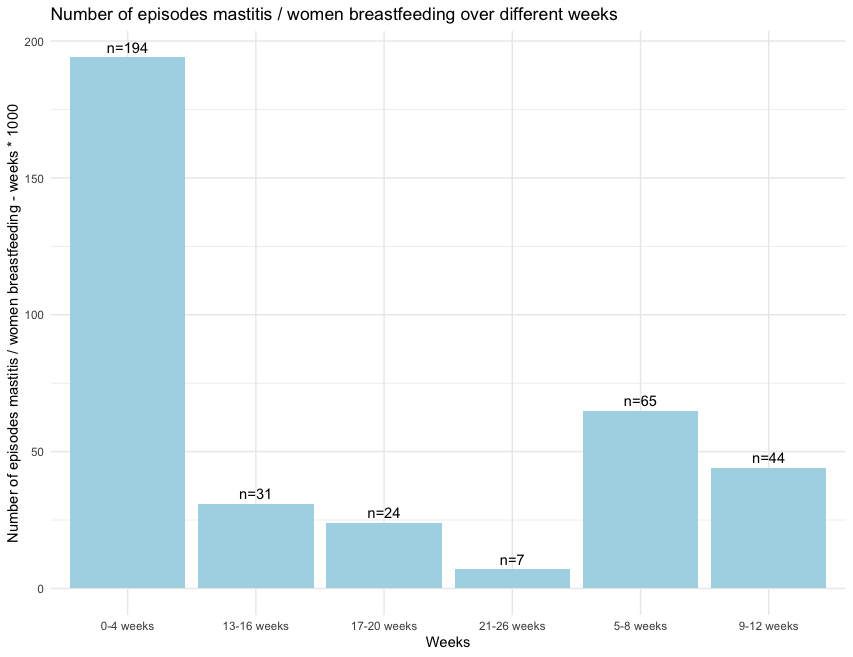

# Example of Matplotlib - bar chart - data in code

| # | Field Name               | Data                             |
|---|--------------------------|----------------------------------|
| 1 | Arxiv URL                |                                  |
| 2 | Visualisation Image      | |
| 3 | Visualisation Caption    | Number of episodes mastitis / women breastfeeding over different weeks |
| 4 | Plotting Data            |      |
| 5 | Code                     | [5_code.R](./5_code.R) (attached in this folder)         |
| 6 | Command                  | `Rscript 5_code.R`           |
| 7 | Natural Language Request | For the given data in the variables "weeks" and "values," show a bar chart using ggplot2. Place the values on top of the bars.|