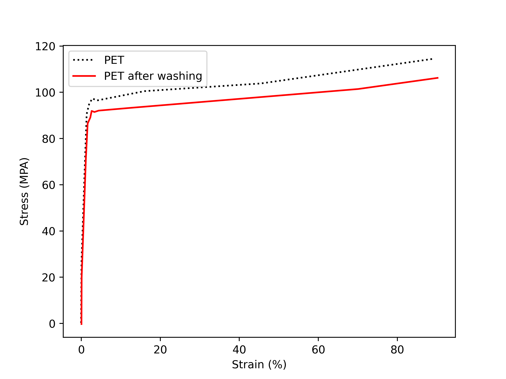

# Example of Matplotlib - line chart - multiple data files

| # | Field Name               | Data                             |
|---|--------------------------|----------------------------------|
| 1 | Arxiv URL                |                                  |
| 2 | Visualisation Image      |  |
| 3 | Visualisation Caption    | Stress-strain curve of PET and PET after washing |
| 4 | Plotting Data            | [4_data.zip](./4_data.zip) (Please upload a zip if multiple data files, we will extract it)|
| 5 | Code                     | [5_code.py](./5_code.py) (attached in this folder)         |
| 6 | Command                  | `python 5_code.py`           |
| 7 | Natural Language Request | For the given "PET.tsv" and "PET after washing" in the "4_data" folder, plot them using lines. Use a dotted black line for "PET" and a red line for "PET after washing." |