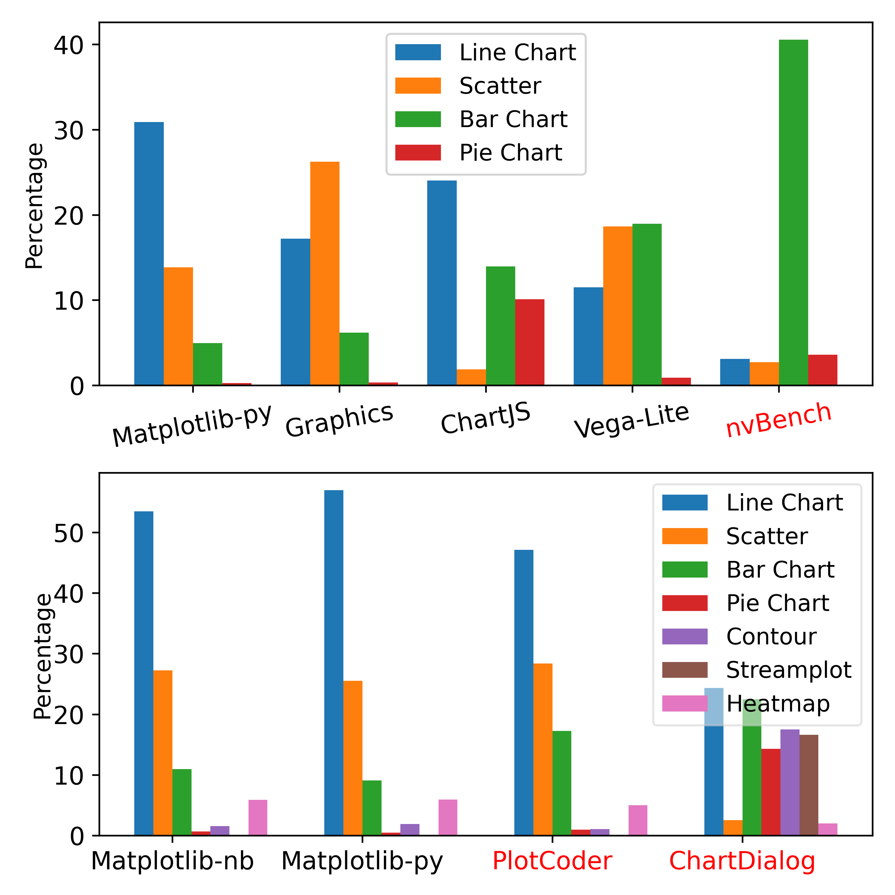

# Example of Matplotlib - 2 grouped bar charts - data in code

| # | Field Name               | Data                             |
|---|--------------------------|----------------------------------|
| 1 | Arxiv URL                |                                  |
| 2 | Visualisation Image      | |
| 3 | Visualisation Caption    | Plot type distribution over 8 datasets |
| 4 | Plotting Data            |      |
| 5 | Code                     | [5_code.py](./5_code.py) (attached in this folder)         |
| 6 | Command                  | `python 5_code.py`           |
| 7 | Natural Language Request | For the given "Data #1" and "Data #2," which are distributions of chart types over datasets, plot these data in one image using bar charts. Mark "PlotCoder," "ChartDialog," and "nvBench" in red. Save the visualisation as "2_visualisation_image.png" with high quality.|