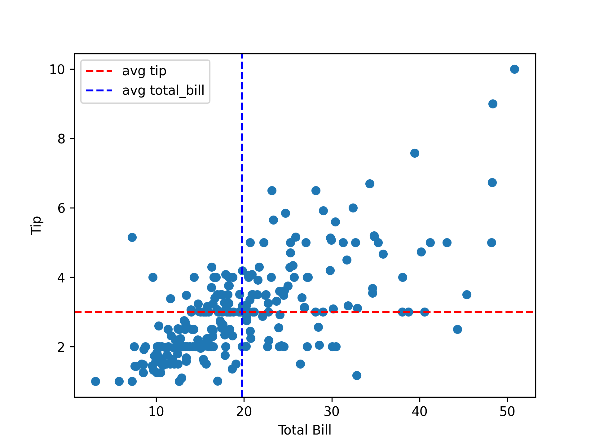

# Example of Recruiting

| # | Field Name               | Data                             |
|---|--------------------------|----------------------------------|
| 1 | Arxiv URL                |                                  |
| 2 | Visualisation Image      |  |
| 3 | Visualisation Caption    | |
| 4 | Plotting Data            | [4_plotting_data.csv](./4_plotting_data.csv) (attached in this folder)|
| 5 | Code                     | [5_code.py](./5_code.py) (attached in this folder)         |
| 6 | Command                  | `python 5_code.py`           |
| 7 | Natural Language Request | `#TODO` |