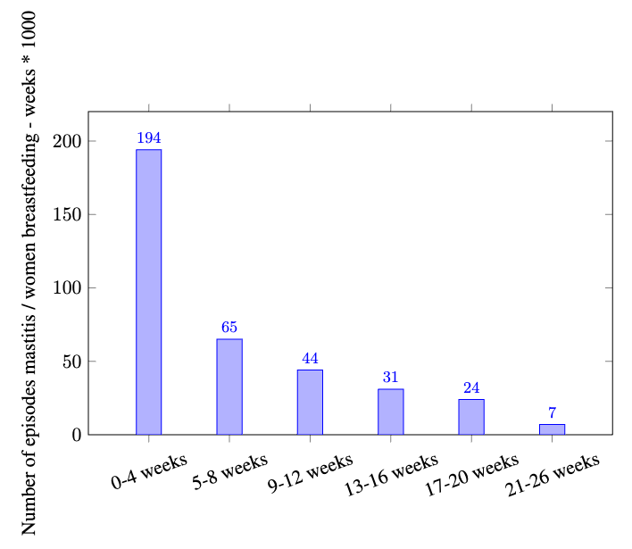

# Example of pgfplots (LaTeX or TeX) - bar chart - data in code

| # | Field Name               | Data                             |
|---|--------------------------|----------------------------------|
| 1 | Arxiv URL                |                                  |
| 2 | Visualisation Image      | |
| 3 | Visualisation Caption    | Number of episodes mastitis / women breastfeeding over different weeks |
| 4 | Plotting Data            | [4_data.json](./4_data.json) (attached in this folder)     |
| 5 | Code                     | [5_code.tex](./5_code.tex) (attached in this folder)         |
| 6 | Command                  |            |
| 7 | Natural Language Request | For the given data in the file "4_data.json". Plot the data in bar chart using TeX. Place the values on top of the bars.|