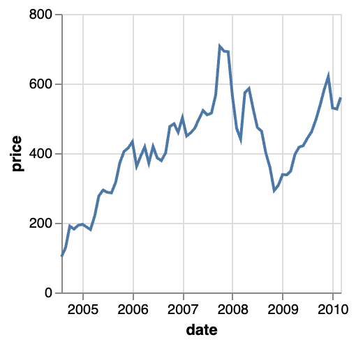

# Example of Vegalite - line chart

| # | Field Name               | Data                             |
|---|--------------------------|----------------------------------|
| 1 | Arxiv URL                |                                  |
| 2 | Visualisation Image      |  |
| 3 | Visualisation Caption    | Google’s stock price over time. |
| 4 | Plotting Data            | [4_stocks.csv](./4_stocks.csv) (attached in this folder)|
| 5 | Code                     | [5_code.json](./5_code.json) (attached in this folder)         |
| 6 | Command                  |            |
| 7 | Natural Language Request | For the given data in "4_stocks.csv", show me Google stock price over time using Vega-lite.|